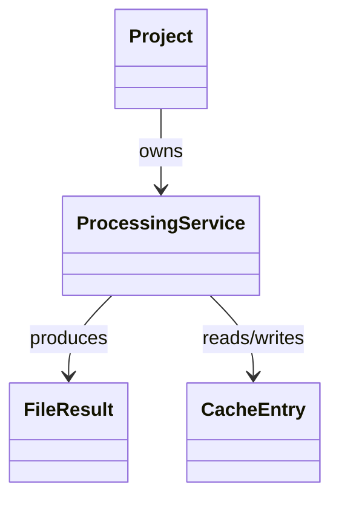

# Domain Model

**Owner:** @bperez

**Last updated:** 29/09/2026

**Sources:** [audit-input-processor-2026-09-29](../tasks/audits/audit-input-processor-2026-09-29.md), [audit-web-crawler-2026-09-29](../tasks/audits/audit-web-crawler-2026-09-29.md), [audit-filesystem-mcp-2026-09-29](../tasks/audits/audit-filesystem-mcp-2026-09-29.md), [audit-scripts-2026-09-29](../tasks/audits/audit-scripts-2026-09-29.md), [audit-gherkin-multiple-v5-2026-09-29](../tasks/audits/audit-gherkin-multiple-v5-2026-09-29.md), [audit-github-agents-2026-09-29](../tasks/audits/audit-github-agents-2026-09-29.md)

Create and maintain this document with `create-domain-model`. Include only
concepts supported by evidence, and mark each one `Implemented`, `Documented`,
or `Proposed`. Mark unproven cardinalities or meanings `To confirm`. These
values are fixed literals: keep them as written. Every entity, value object,
state, enumeration, or rule name must match a `Preferred term` in
`glossary.md`; if it does not exist yet, add it there as `Pending` in the
same pass.

## 1. Purpose and scope

Covers the `input-processor`, `web-crawler`, `filesystem-mcp`, `scripts`,
`.claude/skills/gherkin-multiple-v5`, and `.github` agent/skill
(Gherkin-generation orchestration) contexts: converting raw input files
(browser session recordings, PDFs, Markdown, and plain text) into cached,
structured analysis content usable to generate automated test scenarios;
crawling web applications (optionally authenticated) to extract structured
page content for that same purpose; exposing scoped file-system access as MCP
tools; generating the Docker Compose override that mounts configured projects
into the services that need them; analyzing Gherkin suites for
maintainability metrics; and orchestrating input processing plus crawling
into generated `.feature` files. Scope is limited to what
`audit-input-processor-2026-09-29`, `audit-web-crawler-2026-09-29`,
`audit-filesystem-mcp-2026-09-29`, `audit-scripts-2026-09-29`,
`audit-gherkin-multiple-v5-2026-09-29`, and `audit-github-agents-2026-09-29`
confirmed. The last of these is `Documented` evidence only (Copilot agent and
skill prompt instructions), never `Implemented`, because it describes
LLM-governed behavior rather than deterministic code; every other context is
`Implemented`. This covers every module agreed for this pass;
`specification/` (the requirements-tooling harness) remains out of scope as
non-product tooling.

### Quick visual (optional)



## 2. Contexts or subdomains

| Context | Responsibility | Main concepts |
|---------|----------------|---------------|
| Input processing | Convert per-project input files into cached, structured analysis content for test-scenario generation | Project, ProcessingService, FileResult, CacheEntry, ProviderRegistry, FileHandler, VideoAnalyzer |
| Web crawling | Extract structured page content (links, interactive elements, Markdown) from a web application, optionally authenticating first by replaying a recorded action sequence | AuthActionsFile, ReplayStage, CrawlRequest |
| Filesystem access | Expose scoped read, write, search, and metadata operations over a set of allowed directories as MCP tools | AllowedDirectories, FileInfo, TreeEntry |
| Project provisioning | Validate `projects.json` and generate the Docker Compose override that mounts every configured project into the services that need its folders | SyncProject, ComposeOverride |
| Gherkin quality analysis | Compute maintainability metrics for one or more Gherkin features, export a consolidated Excel workbook, and persist incremental state across upload batches | GherkinFeatureReport, SuiteReport, GherkinState |
| Gherkin generation orchestration | Orchestrate input processing and web crawling into generated `.feature` files following authoring quality rules (Documented evidence only) | GherkinGeneratorAgent, WebCrawlerSubagent, MCPEvidenceBlock |

## 3. Entities and relevant attributes

| Entity | Attribute | Type | Required | Constraints | State |
|--------|-----------|------|----------|-------------|-------|
| Project | name | string | yes | unique per registry; invalid/duplicate names refused | Implemented |
| Project | llm settings | LlmSettings | no | overrides the default provider/model | Implemented |
| ProcessingReport | results | list of FileResult | yes | one entry per processed file | Implemented |
| ProcessingReport | orphaned | list of CacheEntry | yes | cached files whose source disappeared | Implemented |
| FileResult | name | string | yes | original filename | Implemented |
| FileResult | format | string | yes | `.mp4`, `.pdf`, `.md`, `.txt` | Implemented |
| FileResult | sha256 | string | yes | content digest of the source file | Implemented |
| FileResult | status | Processing status | yes | see section 4 | Implemented |
| FileResult | processed_at | timestamp | yes | when the content was produced | Implemented |
| FileResult | error | string | no | only present for status `error` | Implemented |
| CacheEntry | source | string | yes | original filename | Implemented |
| CacheEntry | sha256 | string | yes | content digest | Implemented |
| CacheEntry | processed_at | timestamp | yes | — | Implemented |
| Settings | video | VideoSettings | yes | parsed once from environment | Implemented |
| Settings | projects_config / projects_root | path | yes | defaults `/config/projects.json`, `/projects` | Implemented |
| VideoSettings | segment_seconds, split_min_mb, frame_interval_seconds, max_frames | number | yes | defaults `60`, `12.0`, `2`, `20` | Implemented |
| Provider (catalog entry) | name, base_url, api_key_env, default_model, capabilities | string / list | yes | declared in `catalog.json` | Implemented |
| DocumentSummarizer | prompt | string | yes | default prompt `document_summary`; rejects empty input | Implemented |
| ImageDescriber | prompt | string | yes | default prompt `image_description`; rejects an empty model answer | Implemented |
| PdfToMarkdown | converter state | n/a | yes | injects an image description for every embedded image, in order | Implemented |
| MarkdownImageEnricher | pattern | regex | yes | keeps the original reference when the image is missing or its description fails | Implemented |
| PromptTemplate | name, content | string | yes | backed by `prompts/<name>.md`; loaded once and cached | Implemented |
| CrawlRequest | url, use_dfs, max_depth, max_pages, use_auth | string / bool / number | yes | defaults `use_dfs=False`, `max_depth=2`, `max_pages=50`, `use_auth=True` | Implemented |
| AuthActionsFile | _meta (captured_at, target_url, final_url), actions, navigations | object | yes | written by `capture_auth.py`, read by the crawler | Implemented |
| ReplayStage | stage, url, actions, start_ts, end_ts | number / string / list | yes | bounded by two recorded navigation timestamps | Implemented |
| AllowedDirectories | list of directory paths | list of string | yes | resolved from CLI arguments at startup; every request path is validated against this set | Implemented |
| FileInfo | size, created, modified, accessed, isDirectory, isFile, permissions | mixed | yes | returned by get_file_info | Implemented |
| TreeEntry | name, type, children | string / enum / list | yes | children present only for directories | Implemented |
| SyncProject | name, inputs, preprocessed, cache | string / path | yes | name matches the slug pattern; inputs/preprocessed/cache resolved to absolute host paths | Implemented |
| ComposeOverride | services, volumes | list | yes | only lists services declared in the base compose file; written to `docker-compose.override.yaml` | Implemented |
| GherkinFeatureReport | feature_title, source_name, SPC, OAR, BDI, ASL, FMI | string / number | yes | one per analyzed feature; a zip file is aggregated into a single feature keyed by its stem | Implemented |
| SuiteReport | SPC, OAR, BDI, ASL, SSI | number | yes | `SSI = sum(feature FMI values) / total features` | Implemented |
| GherkinState | version, features, meta | string / object | yes | `features` keyed by normalized feature title, falling back to source filename; rejected if `version` does not match `STATE_VERSION` | Implemented |
| GherkinGeneratorAgent | tools, workflow steps | frontmatter / prose | yes | orchestrates `input-processor` and `Web-Crawler` into generated `.feature` files | Documented |
| WebCrawlerSubagent | tools, forbidden fallbacks, evidence block | frontmatter / prose | yes | restricted to the `web_crawl` MCP tool only | Documented |
| MCPEvidenceBlock | Tool, Calls made, Last call params, Last call status, Error | string / number | yes | must open every `Web-Crawler` response or the response is invalid | Documented |

## 4. Value objects, states, and enumerations

| Name | Kind | Values or rules | State |
|------|------|-----------------|-------|
| Processing status | enumeration | `new`, `cached`, `updated`, `renamed`, `orphaned`, `error` | Implemented |
| Provider capability | enumeration | `text`, `images`, `video_inline` | Implemented |
| Recorded action kind | enumeration | `fill`, `click`, `submit` | Implemented |
| Crawl strategy | enumeration | Breadth-First Search (default), Depth-First Search | Implemented |
| Tree entry type | enumeration | `file`, `directory` | Implemented |
| Project name slug pattern | value object | Lowercase letters, digits, dots, dashes, or underscores, starting with a letter or digit | Implemented |
| Crawl strategy decision (documented) | value object | BFS for first/broad discovery; DFS for a specific deep workflow or after a prior BFS | Documented |

## 5. Known relationships and cardinalities

| Source | Relationship | Target | Multiplicity | Ownership | State |
|--------|--------------|--------|--------------|-----------|-------|
| Project | resolved to | ProjectRuntime | 1..1 | target | Implemented |
| ProjectRuntime | exposes | ProcessingService | 1..1 | target | Implemented |
| ProcessingService | produces | FileResult | 1..0..* | source | Implemented |
| ProcessingService | reconciles | CacheEntry | 1..0..* | source | Implemented |
| HandlerRegistry | registers | FileHandler | 1..0..* | source | Implemented |
| FileHandler | uses | DocumentSummarizer | 0..1..1 | To confirm | Implemented |
| DocumentSummarizer | uses | PromptTemplate | 1..1 | source | Implemented |
| ImageDescriber | uses | PromptTemplate | 1..1 | source | Implemented |
| MarkdownImageEnricher | uses | ImageDescriber | 0..1..1 | source | Implemented |
| PdfToMarkdown | uses | ImageDescriber | 0..1..1 | source | Implemented |
| ProviderRegistry | registers | Provider | 1..0..* | source | Implemented |
| VideoAnalyzer | selected by | Provider capability | 0..*..1 | To confirm | To confirm |
| AuthActionsFile | split into | ReplayStage | 1..0..* | source | Implemented |
| CrawlRequest | drives | ReplayStage | 1..0..* | source | Implemented |

## 6. Processes and business rules

| ID | Process or rule | Description | Related concepts | State |
|----|-----------------|-------------|------------------|-------|
| RULE-1 | Cache reuse | An unchanged source file is reused from cache without reprocessing | ProcessingService, CacheEntry | Implemented |
| RULE-2 | Reprocess and archive | A modified source file is reprocessed and its previous cached version archived | ProcessingService, CacheEntry | Implemented |
| RULE-3 | Rename without reprocessing | A renamed source file is re-keyed without any model call | ProcessingService, CacheEntry | Implemented |
| RULE-4 | Orphan reporting | A source file that disappears from the input folder is reported as orphaned; its cached content stays readable | ProcessingReport, CacheEntry | Implemented |
| RULE-5 | Handler failure isolation | A handler failure is reported with its cause instead of crashing the run | FileHandler, FileResult | Implemented |
| RULE-6 | Per-project isolation | Each project gets its own runtime and lock; a duplicate or invalid project name is refused | Project, ProjectRuntime | Implemented |
| RULE-7 | Provider choice source | LLM provider/model choice comes from project configuration (`projects.json`), never from environment variables | Project, ProviderRegistry | Implemented |
| RULE-8 | Video split with fallback | Long videos are split by duration; a failing split falls back to analyzing the whole file | VideoAnalyzer | Implemented |
| RULE-20 | Format-specific extraction with graceful fallback | A PDF uses its converter for enriched Markdown when configured, else plain text extraction; a Markdown file uses its image enricher when configured, else a raw read | FileHandler, PdfToMarkdown, MarkdownImageEnricher | Implemented |
| RULE-21 | Image-enrichment resilience | A missing local image keeps the original Markdown reference; a failing image description does not abort enrichment of the remaining images | MarkdownImageEnricher | Implemented |
| RULE-22 | Prompt lookup failure is explicit | Loading an unknown prompt name fails, listing every available prompt name | PromptTemplate | Implemented |
| RULE-23 | Empty content short-circuits summarization | Summarizing empty or unreadable content is rejected before any model call, with a clear message | DocumentSummarizer | Implemented |
| RULE-9 | Local host rewrite in Docker | When running inside a Docker container, a `localhost`/`127.0.0.1`/`0.0.0.0` host in a crawl or auth-replay URL is rewritten to `host.docker.internal` | CrawlRequest | Implemented |
| RULE-10 | Multi-stage auth replay | Recorded auth actions are split into stages bounded by recorded page navigations, so a multi-page login flow replays correctly across page transitions | AuthActionsFile, ReplayStage | Implemented |
| RULE-11 | Filesystem access confinement | Every filesystem-mcp operation is rejected unless its resolved path (including symlink targets, or the parent directory for not-yet-existing paths) is within the configured allowed directories | AllowedDirectories | Implemented |
| RULE-12 | Project name and layout parity | A configured project's name must follow the slug pattern, be unique, and its `inputs`/`preprocessed`/`cache` layout must match the container-side project model, so `sync_projects.py` and `input-processor/src/projects/model.py` stay compatible | SyncProject | Implemented |
| RULE-13 | Compose service allowlist | The generated override only declares volumes for services that both need project folders and are already defined in the base compose file; it never introduces a new service | ComposeOverride | Implemented |
| RULE-14 | Missing inputs reported together | When one or more configured projects have a missing `inputs` folder, all of them are reported in a single error rather than failing on the first one found | SyncProject | Implemented |
| RULE-15 | Feature replacement by normalized title | When a Gherkin feature already exists in the accumulated JSON state, its normalized title (or source filename, if untitled) replaces the older entry rather than duplicating it | GherkinState, GherkinFeatureReport | Implemented |
| RULE-16 | State version compatibility | A JSON state file whose `version` does not match the script's `STATE_VERSION` is rejected rather than silently reinterpreted | GherkinState | Implemented |
| RULE-17 | Zip-as-single-feature aggregation | Every supported file inside an uploaded `.zip` is aggregated into one logical feature keyed by the zip's filename | GherkinFeatureReport | Implemented |
| RULE-18 | Mandatory crawl evidence | `WebCrawlerSubagent` must include an MCP evidence block in every response, and must never return simulated or guessed crawl data if `web_crawl` fails | WebCrawlerSubagent, MCPEvidenceBlock | Documented |
| RULE-19 | Rule-based scenario grouping | Generated `.feature` files group scenarios by business rule using the Gherkin `Rule:` keyword instead of comment dividers | GherkinGeneratorAgent | Documented |

## 7. Actors and external integrations

| Actor or system | Kind | Interaction | State |
|-----------------|------|-------------|-------|
| Editor workspace | actor | Selects the active project via the `X-Spec2Test-Project` HTTP header | Implemented |
| LLM providers (native and catalog-based) | external system | Analyze video, image, and document content on behalf of `ProcessingService` | Implemented |
| Local filesystem | external system | Stores per-project input, cache, and preprocessed content | Implemented |
| Target web application | external system | Crawled by `web_crawl`; optionally logged into by replaying recorded auth actions | Implemented |
| MCP client | actor | Calls `filesystem-mcp` tools, scoped to `AllowedDirectories` | Implemented |
| Docker Compose | external system | Reads the generated `docker-compose.override.yaml` to mount project folders into `input-processor` and `filesystem-mcp` | Implemented |
| Claude Code agent | actor | Invokes `analyze_gherkin.py` following the `SKILL.md` workflow and returns the resulting Excel workbook and JSON state | Implemented |
| GherkinGeneratorAgent | actor | Orchestrates `input-processor` and `WebCrawlerSubagent` to produce `.feature` files (Documented) | Documented |
| WebCrawlerSubagent | actor | Restricted to the `web_crawl` MCP tool only, invoked by `GherkinGeneratorAgent` (Documented) | Documented |

## 8. Concept map

```mermaid
classDiagram
    Project --> ProjectRuntime : resolved to
    ProjectRuntime --> ProcessingService : exposes
    ProcessingService --> FileResult : produces
    ProcessingService --> CacheEntry : reconciles
    HandlerRegistry --> FileHandler : registers
    ProviderRegistry --> Provider : registers
    VideoAnalyzer ..> "Provider capability" : selected by
    AuthActionsFile --> ReplayStage : split into
    CrawlRequest --> ReplayStage : drives
    MCPClient --> AllowedDirectories : scoped by
    SyncProject --> ComposeOverride : mounted into
    GherkinState --> GherkinFeatureReport : accumulates
    GherkinFeatureReport --> SuiteReport : combined into
    GherkinGeneratorAgent --> WebCrawlerSubagent : delegates to
    WebCrawlerSubagent --> MCPEvidenceBlock : must produce
```

### Diagram legend

- `-->` relationship or reference
- `*--` composition or ownership
- `o--` aggregation
- `1`, `0..1`, `1..*`, `0..*` multiplicity
- Dashed lines indicate inferred or unconfirmed relationships

## 9. Evidence matrix

| Concept | File | Symbol or reference | State |
|---------|------|---------------------|-------|
| Project / ProjectRegistry / ProjectRuntime / RuntimePool | [projects/model.py](../../input-processor/src/projects/model.py), [projects/registry.py](../../input-processor/src/projects/registry.py), [projects/runtime.py](../../input-processor/src/projects/runtime.py) | `audit-input-processor-2026-09-29` Q3 | Implemented |
| ProcessingReport / FileResult | [processing_service.py](../../input-processor/src/processing_service.py) | `audit-input-processor-2026-09-29` Q1, Q3 | Implemented |
| CacheEntry / CacheIndex / CacheReconciler | [cache/reconcile.py](../../input-processor/src/cache/reconcile.py) | `audit-input-processor-2026-09-29` Q1, Q3 | Implemented |
| Settings / VideoSettings / LlmSettings | [settings.py](../../input-processor/src/settings.py) | `audit-input-processor-2026-09-29` Q3 | Implemented |
| Provider catalog entries | [providers/catalog.json](../../input-processor/src/providers/catalog.json) | `audit-input-processor-2026-09-29` Q3 | Implemented |
| RULE-1 to RULE-6 | `input-processor/tests/test_processing_service.py`, `test_cache.py`, `test_projects.py` | `audit-input-processor-2026-09-29` Q1 | Implemented |
| RULE-7 | `input-processor/tests/test_settings.py` (`test_llm_choices_are_not_read_from_the_environment`) | `audit-input-processor-2026-09-29` Q1 | Implemented |
| RULE-8 | `input-processor/tests/test_video_analyzers.py` | `audit-input-processor-2026-09-29` Q1 | Implemented |
| DocumentSummarizer / ImageDescriber / PdfToMarkdown / MarkdownImageEnricher / PromptTemplate / RULE-20 to RULE-23 | [analysis/document_summarizer.py](../../input-processor/src/analysis/document_summarizer.py), [analysis/image_describer.py](../../input-processor/src/analysis/image_describer.py), [preprocessing/pdf_to_markdown.py](../../input-processor/src/preprocessing/pdf_to_markdown.py), [preprocessing/markdown_images.py](../../input-processor/src/preprocessing/markdown_images.py), [prompts/__init__.py](../../input-processor/src/prompts/__init__.py) | `audit-input-processor-2026-09-29` Addendum Q1-Q3 | Implemented |
| Editor workspace actor | [projects/headers.py](../../input-processor/src/projects/headers.py) | `audit-input-processor-2026-09-29` Q4 | Implemented |
| CrawlRequest / crawl strategy | [main.py](../../web-crawler/src/main.py), [web_crawler.py](../../web-crawler/src/crawler/web_crawler.py) | `audit-web-crawler-2026-09-29` Q2, Q3 | Implemented |
| AuthActionsFile / ReplayStage | [capture_auth.py](../../web-crawler/capture_auth.py), [web_crawler.py#L49-L85](../../web-crawler/src/crawler/web_crawler.py) | `audit-web-crawler-2026-09-29` Q3, Q7 | Implemented |
| RULE-9 / RULE-10 | [web_crawler.py#L17-L46](../../web-crawler/src/crawler/web_crawler.py) | `audit-web-crawler-2026-09-29` Q3 | Implemented |
| AllowedDirectories / RULE-11 | [index.ts#L20-L94](../../filesystem-mcp/index.ts) validatePath | `audit-filesystem-mcp-2026-09-29` Q3, Q4 | Implemented |
| FileInfo / TreeEntry | [index.ts#L151-L159](../../filesystem-mcp/index.ts), [index.ts#L538-L542](../../filesystem-mcp/index.ts) | `audit-filesystem-mcp-2026-09-29` Q3 | Implemented |
| SyncProject / RULE-12 to RULE-14 | [sync_projects.py](../../scripts/sync_projects.py) | `audit-scripts-2026-09-29` Q1, Q3 | Implemented |
| GherkinFeatureReport / SuiteReport / GherkinState | [analyze_gherkin.py](../../.claude/skills/gherkin-multiple-v5/scripts/analyze_gherkin.py), `SKILL.md` | `audit-gherkin-multiple-v5-2026-09-29` Q2, Q3 | Implemented |
| RULE-15 to RULE-17 | [analyze_gherkin.py#L989-L1075](../../.claude/skills/gherkin-multiple-v5/scripts/analyze_gherkin.py) | `audit-gherkin-multiple-v5-2026-09-29` Q3 | Implemented |
| GherkinGeneratorAgent / WebCrawlerSubagent / MCPEvidenceBlock | [Gherkin-Generator.agent.md](../../.github/agents/Gherkin-Generator.agent.md), [Web-Crawler.agent.md](../../.github/agents/Web-Crawler.agent.md) | `audit-github-agents-2026-09-29` Q2, Q3, Q4 | Documented |
| RULE-18 / RULE-19 | [Web-Crawler.agent.md](../../.github/agents/Web-Crawler.agent.md), [Gherkin-Generator.agent.md](../../.github/agents/Gherkin-Generator.agent.md) | `audit-github-agents-2026-09-29` Q3 | Documented |

## 10. Gaps, ambiguities, and pending decisions

| Topic | Description | Pending action |
|-------|-------------|----------------|
| VideoAnalyzer selection multiplicity | The exact selection rule between a `VideoAnalyzer` and a provider's declared capability was not confirmed at the code level within this pass | Confirm with a targeted read of the analyzer factory before relying on this relationship elsewhere |
| Access control beyond project scoping | No user- or role-based authorization was found within the analyzed scope; only per-project header scoping was confirmed | Confirm whether authorization is enforced at an infrastructure layer outside this repository |
| No tests for `web-crawler` | No test files exist for this module within the analyzed scope, so Q1 behaviors are not confirmed by tests | Add tests, or record this as an accepted gap |
| Plaintext credentials in auth actions file | `capture_auth.py` masks password values only in console output; the JSON file it writes stores the recorded `fill` value (including passwords) in plain text | Confirm whether this file should be encrypted, gitignored, or have password values redacted before persistence |
| `move_file` documented vs. implemented overwrite behavior | The tool description states the operation fails if the destination exists, but the handler calls `fs.rename` with no explicit existence check; actual overwrite behavior is platform-dependent | Confirm the intended behavior and align the code or the description (see `audit-filesystem-mcp-2026-09-29` contradiction 1) |
| No tests for `filesystem-mcp` | No test files exist for this module within the analyzed scope, so Q1 behaviors are not confirmed by tests | Add tests, or record this as an accepted gap |
| No tests for `gherkin-multiple-v5` | No test files exist for this module within the analyzed scope; its metric-scoring internals were confirmed through their function outline and `SKILL.md`'s formulas, not a full line-by-line read | Add tests, or record this as an accepted gap |
| Overlapping authoring-rule documents | `Gherkin-Generator.agent.md`'s BRIEF section and `.github/skills/gherkin/SKILL.md` state overlapping (not conflicting) authoring rules in two places | Consider consolidating into a single source of truth to avoid future drift |
| Prompt-governed behavior is not independently verifiable | `GherkinGeneratorAgent`, `WebCrawlerSubagent`, RULE-18, and RULE-19 are `Documented`, not `Implemented`: reading the instructions confirms intent, not guaranteed runtime compliance | No action required; keep this evidence state distinction explicit wherever these concepts are cited |

## 11. Change History

| Date | Author | Change | Agent |
|-------|-------|--------|-------|
| 29/09/2026 | @bperez | Created the domain model from the validated `input-processor` audit | analyst-requirements (Claude Sonnet 5) |
| 29/09/2026 | @bperez | Added the `web-crawler` context, entities, rules, and actors from the validated `web-crawler` audit | analyst-requirements (Claude Sonnet 5) |
| 29/09/2026 | @bperez | Added the `filesystem-mcp` context, entities, rule, and actor from the validated `filesystem-mcp` audit | analyst-requirements (Claude Sonnet 5) |
| 29/09/2026 | @bperez | Added the `scripts` (project provisioning) context, entities, and rules from the validated `scripts` audit | analyst-requirements (Claude Sonnet 5) |
| 29/09/2026 | @bperez | Added the `gherkin-multiple-v5` context, entities, rules, and actor from the validated `gherkin-multiple-v5` audit | analyst-requirements (Claude Sonnet 5) |
| 29/09/2026 | @bperez | Added the `.github` agent/skill (Gherkin generation orchestration) context, entities, rules, and actors from the validated `github-agents` audit, marked `Documented` throughout | analyst-requirements (Claude Sonnet 5) |
| 29/09/2026 | @bperez | Added the content-extraction and summarization entities and rules from the `input-processor` audit addendum | analyst-requirements (Claude Sonnet 5) |
